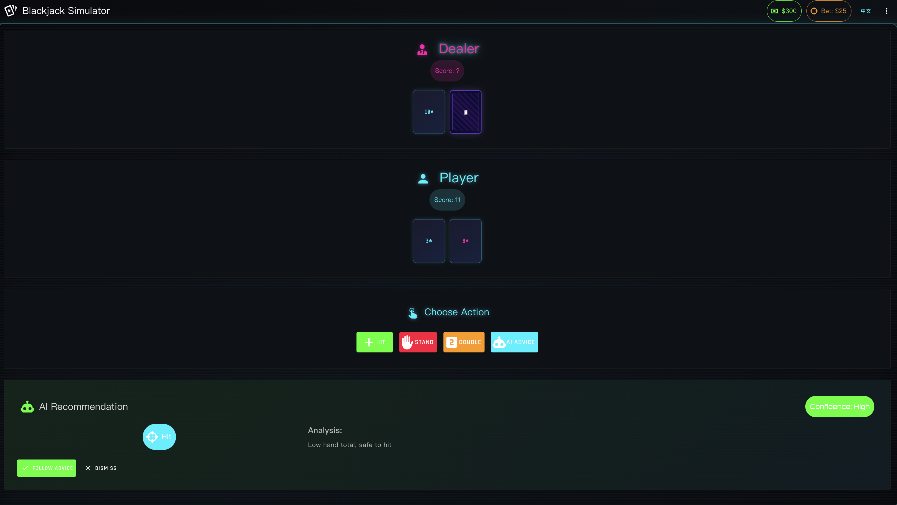
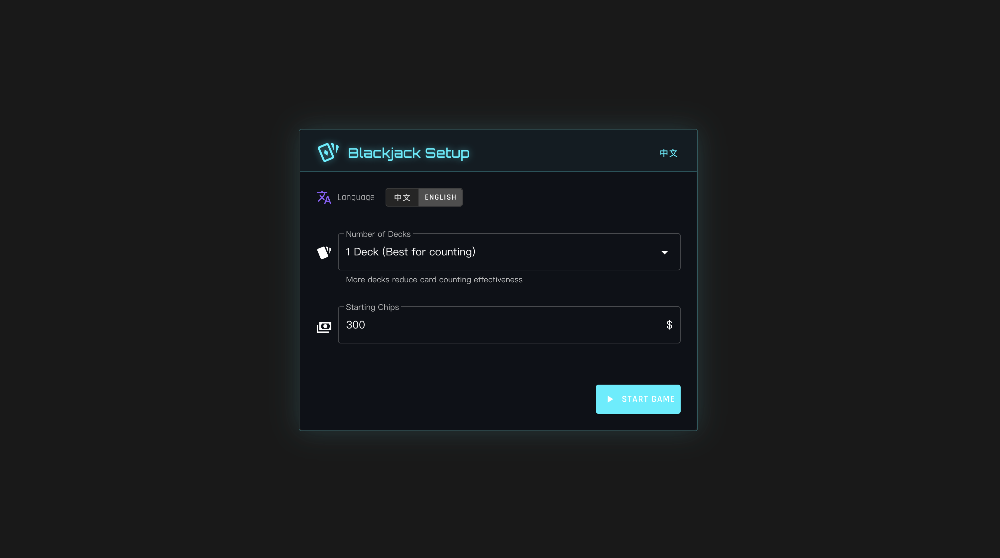
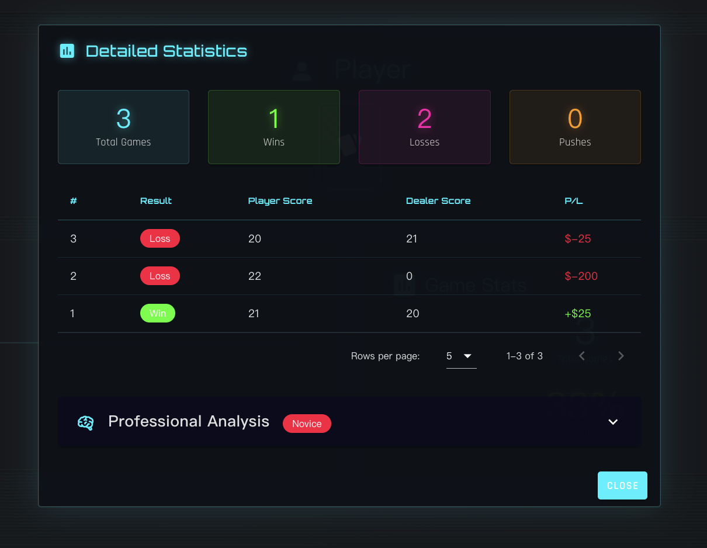
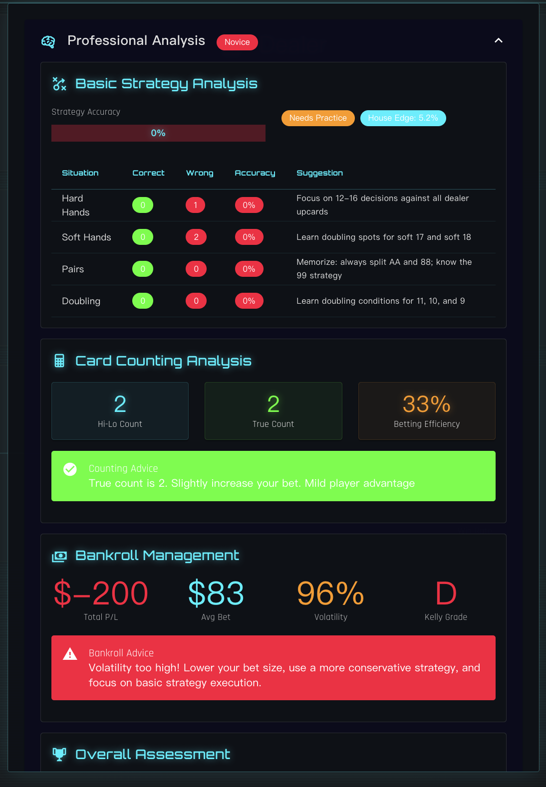
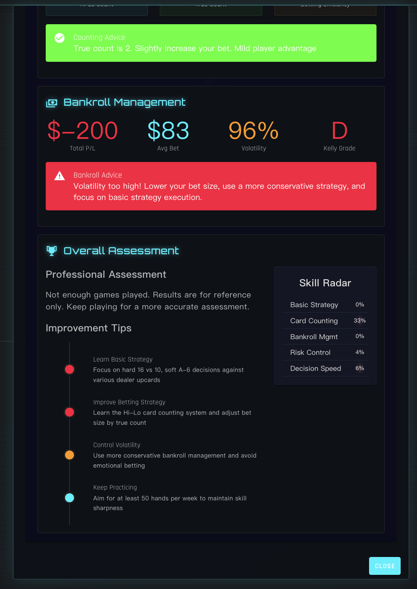

<div align="center">

# Blackjack AI Agent

### A Hybrid LLM + Numerical Optimization Blackjack System

**[Live Demo](https://blackjack-agent.onrender.com/)** &nbsp; *(Lite Edition — rule-based strategy, no LLM)*

<br>

**English** | [中文](#中文文档)

<br>



</div>

---

## Overview

Blackjack AI Agent is an intelligent blackjack system that combines **numerical optimization** with **LLM-enhanced reasoning** to achieve near-optimal play. The system features a cyberpunk-styled web interface, real-time AI decision support, and comprehensive performance analytics.

The project ships in two editions:

## Editions

| | Lite Edition | Full Edition |
|:--|:------------|:-------------|
| **Web game UI** | Yes | Yes |
| **Basic strategy advice** | Rule-based (if/else) | LangChain ReAct Agent with 6 AI tools |
| **Card counting analytics** | Frontend only (Hi-Lo stats) | Full Hi-Lo system with true count + bet sizing |
| **Monte Carlo simulation** | No | 10,000-iteration outcome prediction |
| **Kelly Criterion bankroll** | No | Optimal bet sizing based on edge |
| **LLM reasoning** | No | Deepseek R1 via Ollama |
| **AI training pipeline** | No | 3-stage hybrid training (numerical + LLM + validation) |
| **Terminal game mode** | No | Yes |
| **Streamlit dashboard** | No | Yes |
| **Dependencies** | 3 packages (flask, flask-cors, gunicorn) | 20+ packages (LangChain, NumPy, SciPy, Pandas, etc.) |
| **Requires Ollama** | No | Yes |
| **RAM requirement** | < 512 MB | 8 GB+ recommended |
| **Live demo** | **[blackjack-agent.onrender.com](https://blackjack-agent.onrender.com/)** | Run locally |

## Key Features

- **Hybrid AI Architecture** — Numerical optimization + LLM reasoning via LangChain ReAct agent *(Full Edition)*
- **6 Specialized AI Tools** — Basic strategy, card counting (Hi-Lo), Monte Carlo simulation, Kelly Criterion bankroll management, risk assessment, game state analysis *(Full Edition)*
- **Real-time AI Advice** — Get strategy recommendations with confidence levels and reasoning during gameplay
- **Professional Analytics** — Strategy accuracy tracking, card counting analysis, bankroll management scoring, skill radar
- **Cyberpunk UI** — Dark neon-glow interface with Orbitron typography, scan-line effects, and animated cards
- **Bilingual** — Full Chinese/English support with one-click language toggle

## Screenshots

<table>
<tr>
<td width="50%"><br><sub>Game Setup — Configure decks and starting chips</sub></td>
<td width="50%"><br><sub>Gameplay — AI recommendation with confidence level</sub></td>
</tr>
<tr>
<td width="50%"><br><sub>Detailed Statistics — Game history and win/loss tracking</sub></td>
<td width="50%"><br><sub>Professional Analysis — Strategy accuracy and card counting</sub></td>
</tr>
<tr>
<td colspan="2" align="center"><br><sub>Overall Assessment — Bankroll management and skill evaluation</sub></td>
</tr>
</table>

## Quick Start

### Lite Edition

The Lite Edition runs the web game with rule-based strategy advice. No LLM, no Ollama, no heavy dependencies. This is the same version deployed at the [live demo](https://blackjack-agent.onrender.com/).

```bash
git clone https://github.com/natechch1/blackjack-agent.git
cd blackjack-agent

python -m venv venv
source venv/bin/activate      # macOS/Linux
# venv\Scripts\activate       # Windows

pip install -r requirements-deploy.txt

python3 server.py
# Open http://localhost:8888
```

That's it. 3 packages, under 30 seconds.

### Full Edition

The Full Edition adds the LangChain ReAct AI agent, 3-stage hybrid training pipeline, Monte Carlo simulation, Kelly Criterion bankroll management, and terminal/dashboard modes.

#### Prerequisites

- Python 3.9+
- [Ollama](https://ollama.ai/) installed and running
- 8 GB+ RAM recommended

#### 1. Install dependencies

```bash
git clone https://github.com/natechch1/blackjack-agent.git
cd blackjack-agent

python -m venv venv
source venv/bin/activate      # macOS/Linux
# venv\Scripts\activate       # Windows

pip install -r requirements.txt
```

#### 2. Set up Ollama + LLM

```bash
# Install Ollama (if not installed)
# macOS: brew install ollama
# Linux: curl -fsSL https://ollama.ai/install.sh | sh

# Start Ollama server
ollama serve

# Pull the default model (in a new terminal)
ollama pull deepseek-r1:1.5b
```

Alternative models: `llama3:8b`, `qwen2:7b`

#### 3. Configure environment

```bash
cp .env.example .env   # or create .env manually
```

`.env` contents:
```
OLLAMA_BASE_URL=http://localhost:11434
PYTHONPATH=/path/to/blackjack-agent/src
LOG_LEVEL=INFO
```

#### 4. Train AI models

```bash
# Demo (3 min) — quick test
python3 hybrid_train.py --mode demo

# Standard (15 min) — recommended
python3 hybrid_train.py --mode standard

# Deep (30 min) — best performance
python3 hybrid_train.py --mode deep
```

#### 5. Play

```bash
# Web UI (recommended) — opens http://localhost:8888
./play

# Terminal mode
python3 terminal_simulator.py

# Benchmark a trained model
python3 hybrid_play.py --mode list                       # list trained models
python3 hybrid_play.py --mode benchmark --episodes 1000  # run benchmark
python3 hybrid_play.py --mode play --rounds 10           # interactive play
```

## How to Play

1. **Setup** — Choose number of decks and starting chips, then click **Start Game**
2. **Bet** — Use the chip buttons or slider to set your bet, then click **Deal**
3. **Play** — Choose **Hit**, **Stand**, or **Double**. Click **AI Advice** for strategy recommendation
4. **Review** — After each hand, see the result and P/L. Click **Next Hand** to continue
5. **Statistics** — Open the menu (top right) to view detailed analytics, strategy accuracy, card counting stats, and bankroll management scoring

## Tech Stack

### Frontend

| Technology | Version | Purpose |
|:-----------|:--------|:--------|
| Vue.js | 2.7.14 | Reactive UI framework |
| Vuetify | 2.6.14 | Material Design component library (dark theme) |
| Axios | latest | HTTP client for API communication |
| Google Fonts | — | Orbitron, Share Tech Mono, Rajdhani (cyberpunk typography) |
| Material Design Icons | 6.x | Icon system |

**UI Design:** Cyberpunk aesthetic — dark base (`#0a0a0f`), neon cyan (`#00f0ff`), magenta (`#ff00aa`), electric purple (`#8b5cf6`), neon green (`#39ff14`). Features scan-line overlay, neon glow animations, glassmorphism panels, and angular button styling.

### Backend

| Technology | Version | Purpose |
|:-----------|:--------|:--------|
| Python | 3.9+ | Core language |
| Flask | latest | Web server & REST API |
| Flask-CORS | latest | Cross-origin resource sharing |

**API Endpoints:**

| Endpoint | Method | Description |
|:---------|:-------|:------------|
| `/api/health` | GET | Server health check |
| `/api/game/start` | POST | Initialize game session |
| `/api/game/<id>/deal` | POST | Deal a new hand |
| `/api/game/<id>/hit` | POST | Player hits (draw card) |
| `/api/game/<id>/decision` | POST | Get AI strategy recommendation |

### AI / Machine Learning *(Full Edition only)*

| Technology | Version | Purpose |
|:-----------|:--------|:--------|
| LangChain | 0.1.16 | ReAct agent framework with 6 tools |
| Ollama | 0.1.8 | Local LLM inference server |
| Deepseek R1 | 1.5B | Default reasoning model |
| NumPy | 1.24.3 | Numerical computation |
| SciPy | 1.10.1 | Statistical optimization |
| Pandas | 2.0.3 | Data analysis |

**AI Agent Tools:**

| Tool | Algorithm | Description |
|:-----|:----------|:------------|
| Basic Strategy Advisor | Lookup tables (hard/soft/pairs) | Optimal action based on player hand vs dealer upcard |
| Card Counting | Hi-Lo system | Running count → true count → bet sizing recommendation |
| Monte Carlo Simulation | 10,000-iteration sampling | Win/lose/push probability estimation |
| Betting Advisor | Kelly Criterion (0.25 fraction) | Optimal bet size based on edge and bankroll |
| Risk Assessor | Volatility + stop-loss analysis | Bankroll health and session stop conditions |
| Game State Analyzer | Multi-factor evaluation | Comprehensive situation assessment |

**3-Stage Hybrid Training:**

```
Stage 1: Numerical Optimization          Stage 2: LLM Fine-tuning          Stage 3: Game Validation
┌─────────────────────────┐         ┌──────────────────────┐         ┌────────────────────────┐
│ Pure simulation          │   ──►   │ Deepseek R1 via      │   ──►   │ Real game environment   │
│ No LLM overhead          │         │ Ollama + LangChain   │         │ Statistical validation  │
│ Optimize decision        │         │ Refine edge cases     │         │ Win rate & profit       │
│ thresholds rapidly       │         │ Improve adaptability  │         │ metrics verification    │
└─────────────────────────┘         └──────────────────────┘         └────────────────────────┘
```

### Visualization & Analysis *(Full Edition only)*

| Technology | Version | Purpose |
|:-----------|:--------|:--------|
| Plotly | 5.14.1 | Interactive charts |
| Matplotlib | 3.7.1 | Static visualizations |
| Streamlit | 1.32.2 | Analytics dashboard |
| Seaborn | 0.12.2 | Statistical plots |

### Dev & Config

| Technology | Version | Purpose |
|:-----------|:--------|:--------|
| PyYAML | 6.0 | Configuration management |
| python-dotenv | 1.0.0 | Environment variables |
| Pydantic | 2.7.0 | Data validation |
| Loguru | 0.7.0 | Structured logging |
| Pytest | 7.4.0 | Testing framework |

## Architecture

```
┌──────────────────────────────────────────────────────┐
│                   Web Browser (Vue.js)                │
│  ┌──────────┐  ┌───────────┐  ┌───────────────────┐  │
│  │  Game UI  │  │ AI Panel  │  │  Statistics Modal  │  │
│  └─────┬────┘  └─────┬─────┘  └─────────┬─────────┘  │
└────────┼─────────────┼───────────────────┼────────────┘
         │    Axios     │                  │
         ▼             ▼                  ▼
┌──────────────────────────────────────────────────────┐
│                  Flask API Server                     │
│  ┌──────────┐  ┌───────────┐  ┌───────────────────┐  │
│  │ Game API  │  │Decision   │  │  Session Manager  │  │
│  │ deal/hit  │  │  API      │  │                   │  │
│  └─────┬────┘  └─────┬─────┘  └───────────────────┘  │
└────────┼─────────────┼────────────────────────────────┘
         │             │
         ▼             ▼
┌────────────┐  ┌──────────────────────────────────────┐
│   Game     │  │   LangChain ReAct Agent               │
│   Engine   │  │   (Full Edition only)                  │
│            │  │  ┌────────┐ ┌────────┐ ┌──────────┐  │
│  • Cards   │  │  │Basic   │ │Card    │ │Monte     │  │
│  • Rules   │  │  │Strategy│ │Counting│ │Carlo Sim │  │
│  • Scoring │  │  └────────┘ └────────┘ └──────────┘  │
│            │  │  ┌────────┐ ┌────────┐ ┌──────────┐  │
│            │  │  │Betting │ │Risk    │ │Game State│  │
│            │  │  │Advisor │ │Assessor│ │Analyzer  │  │
│            │  │  └────────┘ └────────┘ └──────────┘  │
└────────────┘  │              │                        │
  (Both         │              ▼                        │
   Editions)    │     ┌────────────────┐               │
                │     │  Ollama (LLM)  │               │
                │     │ Deepseek R1    │               │
                │     └────────────────┘               │
                └──────────────────────────────────────┘
```

> **Lite Edition** uses only the Game Engine (left) with rule-based if/else strategy in `server.py`.
> **Full Edition** adds the entire LangChain ReAct Agent stack (right) with LLM-powered decision making.

## Performance *(Full Edition, trained model)*

| Metric | Value |
|:-------|:------|
| Win Rate | 40–45% |
| Avg Profit / Hand | +$0.30 to +$0.50 |
| Hourly Profit (est.) | +$30–50 at $25 base bet |
| Model Size | ~10–50 KB (JSON) |

## Project Structure

```
blackjack-agent/
├── play                        # One-click launcher script
├── server.py                   # Flask web server + REST API
├── index.html                  # Vue.js cyberpunk game UI
├── start.py                    # Auto-launch with browser open
├── hybrid_train.py             # 3-stage hybrid training pipeline  [Full]
├── hybrid_play.py              # Game player & benchmarker         [Full]
├── numerical_train.py          # Pure numerical optimization       [Full]
├── terminal_simulator.py       # Terminal interactive game         [Full]
├── requirements-deploy.txt     # Lite Edition dependencies (3 packages)
├── requirements.txt            # Full Edition dependencies (20+ packages)
├── src/
│   ├── agent/
│   │   └── blackjack_agent.py  # LangChain ReAct agent (6 tools)  [Full]
│   ├── game/
│   │   ├── blackjack_env.py    # Game rules & state machine
│   │   └── cards.py            # Card, Hand, Shoe classes
│   ├── tools/
│   │   ├── basic_strategy.py   # Hard/soft/pair lookup tables      [Full]
│   │   ├── card_counting.py    # Hi-Lo counting system             [Full]
│   │   ├── monte_carlo.py      # 10K-iteration simulation          [Full]
│   │   └── money_management.py # Kelly Criterion bankroll manager  [Full]
│   ├── training/
│   │   └── self_play.py        # Self-play training loop           [Full]
│   └── ui/
│       ├── blackjack_simulator.py
│       └── dashboard.py        # Streamlit analytics dashboard     [Full]
├── config/
│   ├── config.yaml             # Main config (LLM, rules, bankroll)
│   └── training_config.yaml    # Training parameters
├── models/                     # Trained model outputs (JSON)
├── docs/
│   ├── screenshots/            # UI screenshots
│   ├── logo.svg                # Cyberpunk logo
│   ├── logo.png                # Logo (512x512)
│   └── og-banner.png           # Social media preview (1200x630)
└── render.yaml                 # Render.com deployment config
```

## License

MIT

---

<div align="center">

# 中文文档

### 混合 LLM + 数值优化的 21 点 AI 系统

**[在线体验](https://blackjack-agent.onrender.com/)** &nbsp; *(轻量版 — 基于规则的策略，无 LLM)*

<br>

[English](#blackjack-ai-agent) | **中文**

<br>


</div>

---

## 概述

Blackjack AI Agent 是一个智能 21 点系统，结合**数值优化**和**大语言模型推理**实现接近最优的游戏策略。系统拥有赛博朋克风格的 Web 界面、实时 AI 决策支持和专业的性能分析。

本项目提供两个版本：

## 版本对比

| | 轻量版 (Lite) | 满血版 (Full) |
|:--|:------------|:-------------|
| **Web 游戏界面** | 有 | 有 |
| **基本策略建议** | 规则引擎（if/else） | LangChain ReAct 智能体 + 6 个 AI 工具 |
| **算牌分析** | 仅前端（Hi-Lo 统计） | 完整 Hi-Lo 系统 + 真实计数 + 下注建议 |
| **蒙特卡洛模拟** | 无 | 10,000 次迭代预测 |
| **凯利公式资金管理** | 无 | 基于优势的最优下注 |
| **LLM 推理** | 无 | Deepseek R1（通过 Ollama） |
| **AI 训练流水线** | 无 | 三阶段混合训练（数值 + LLM + 验证） |
| **终端游戏模式** | 无 | 有 |
| **Streamlit 仪表盘** | 无 | 有 |
| **依赖包** | 3 个（flask, flask-cors, gunicorn） | 20+ 个（LangChain, NumPy, SciPy, Pandas 等） |
| **需要 Ollama** | 否 | 是 |
| **内存要求** | < 512 MB | 建议 8 GB+ |
| **在线体验** | **[blackjack-agent.onrender.com](https://blackjack-agent.onrender.com/)** | 本地运行 |

## 核心功能

- **混合 AI 架构** — 数值优化 + LangChain ReAct 智能体驱动的 LLM 推理 *(满血版)*
- **6 大专业工具** — 基本策略、Hi-Lo 算牌、蒙特卡洛模拟、凯利公式资金管理、风险评估、牌局分析 *(满血版)*
- **实时 AI 建议** — 游戏中获取带置信度和推理依据的策略建议
- **专业分析面板** — 策略准确率、算牌分析、资金管理评分、技能雷达图
- **赛博朋克 UI** — 暗色霓虹风格界面，Orbitron 字体，扫描线特效，动态发牌动画
- **中英双语** — 一键切换中文/English 界面

## 界面展示

<table>
<tr>
<td width="50%"><br><sub>游戏设置 — 配置牌副数和初始筹码</sub></td>
<td width="50%"><br><sub>游戏进行 — AI 实时建议与置信度分析</sub></td>
</tr>
<tr>
<td width="50%"><br><sub>详细统计 — 游戏历史与胜负追踪</sub></td>
<td width="50%"><br><sub>专业分析 — 策略准确率与算牌系统</sub></td>
</tr>
<tr>
<td colspan="2" align="center"><br><sub>综合评估 — 资金管理分析与技能评估</sub></td>
</tr>
</table>

## 快速开始

### 轻量版 (Lite Edition)

轻量版运行 Web 游戏，使用规则引擎提供策略建议。无需 LLM、Ollama 或大量依赖。这与[在线体验](https://blackjack-agent.onrender.com/)运行的版本相同。

```bash
git clone https://github.com/natechch1/blackjack-agent.git
cd blackjack-agent

python -m venv venv
source venv/bin/activate      # macOS/Linux
# venv\Scripts\activate       # Windows

pip install -r requirements-deploy.txt

python3 server.py
# 打开 http://localhost:8888
```

就这么简单。3 个依赖包，30 秒内启动。

### 满血版 (Full Edition)

满血版在轻量版基础上增加 LangChain ReAct AI 智能体、三阶段混合训练流水线、蒙特卡洛模拟、凯利公式资金管理，以及终端游戏和分析仪表盘。

#### 环境要求

- Python 3.9+
- [Ollama](https://ollama.ai/) 已安装并运行
- 建议 8 GB+ 内存

#### 1. 安装依赖

```bash
git clone https://github.com/natechch1/blackjack-agent.git
cd blackjack-agent

python -m venv venv
source venv/bin/activate      # macOS/Linux
# venv\Scripts\activate       # Windows

pip install -r requirements.txt
```

#### 2. 配置 Ollama + LLM

```bash
# 安装 Ollama（如未安装）
# macOS: brew install ollama
# Linux: curl -fsSL https://ollama.ai/install.sh | sh

# 启动 Ollama 服务
ollama serve

# 拉取默认模型（新开一个终端）
ollama pull deepseek-r1:1.5b
```

可选模型：`llama3:8b`、`qwen2:7b`

#### 3. 配置环境变量

```bash
cp .env.example .env   # 或手动创建 .env
```

`.env` 内容：
```
OLLAMA_BASE_URL=http://localhost:11434
PYTHONPATH=/path/to/blackjack-agent/src
LOG_LEVEL=INFO
```

#### 4. 训练 AI 模型

```bash
# 演示模式（3 分钟）— 快速体验
python3 hybrid_train.py --mode demo

# 标准模式（15 分钟）— 推荐
python3 hybrid_train.py --mode standard

# 深度模式（30 分钟）— 最佳性能
python3 hybrid_train.py --mode deep
```

#### 5. 开始游戏

```bash
# Web 界面（推荐）— 自动打开 http://localhost:8888
./play

# 终端模式
python3 terminal_simulator.py

# 基准测试
python3 hybrid_play.py --mode list                       # 查看已训练模型
python3 hybrid_play.py --mode benchmark --episodes 1000  # 运行基准测试
python3 hybrid_play.py --mode play --rounds 10           # 交互式游戏
```

## 游玩指南

1. **设置** — 选择牌副数和初始筹码，点击 **开始游戏**
2. **下注** — 使用筹码按钮或滑杆设定赌注，点击 **发牌**
3. **操作** — 选择 **要牌**、**停牌** 或 **加倍**，点击 **AI建议** 获取策略推荐
4. **结算** — 每局结束查看结果和盈亏，点击 **下一局** 继续
5. **分析** — 点击右上角菜单查看详细统计、策略准确率、算牌数据和资金管理评分

## 技术栈

### 前端

| 技术 | 版本 | 用途 |
|:-----|:-----|:-----|
| Vue.js | 2.7.14 | 响应式 UI 框架 |
| Vuetify | 2.6.14 | Material Design 组件库（暗色主题） |
| Axios | latest | HTTP 请求客户端 |
| Google Fonts | — | Orbitron、Share Tech Mono、Rajdhani 赛博朋克字体 |
| Material Design Icons | 6.x | 图标系统 |

**UI 设计：** 赛博朋克美学 — 深色底色 (`#0a0a0f`)、霓虹青 (`#00f0ff`)、品红 (`#ff00aa`)、电紫 (`#8b5cf6`)、霓虹绿 (`#39ff14`)。包含扫描线叠加层、霓虹发光动画、毛玻璃面板、棱角按钮风格。

### 后端

| 技术 | 版本 | 用途 |
|:-----|:-----|:-----|
| Python | 3.9+ | 核心语言 |
| Flask | latest | Web 服务器与 REST API |
| Flask-CORS | latest | 跨域资源共享 |

**API 接口：**

| 接口 | 方法 | 描述 |
|:-----|:-----|:-----|
| `/api/health` | GET | 服务器健康检查 |
| `/api/game/start` | POST | 初始化游戏会话 |
| `/api/game/<id>/deal` | POST | 发牌 |
| `/api/game/<id>/hit` | POST | 要牌 |
| `/api/game/<id>/decision` | POST | 获取 AI 策略建议 |

### AI / 机器学习 *(仅满血版)*

| 技术 | 版本 | 用途 |
|:-----|:-----|:-----|
| LangChain | 0.1.16 | ReAct 智能体框架（6 工具） |
| Ollama | 0.1.8 | 本地 LLM 推理服务器 |
| Deepseek R1 | 1.5B | 默认推理模型 |
| NumPy | 1.24.3 | 数值计算 |
| SciPy | 1.10.1 | 统计优化 |
| Pandas | 2.0.3 | 数据分析 |

**AI 智能体工具：**

| 工具 | 算法 | 描述 |
|:-----|:-----|:-----|
| 基本策略顾问 | 查表法（硬牌/软牌/对子） | 根据玩家手牌 vs 庄家明牌给出最优动作 |
| 算牌系统 | Hi-Lo 计数法 | 流水计数 → 真实计数 → 下注建议 |
| 蒙特卡洛模拟 | 10,000 次迭代采样 | 胜/负/平概率估算 |
| 下注顾问 | 凯利公式（0.25 系数） | 基于优势和资金的最优下注额 |
| 风险评估器 | 波动率 + 止损分析 | 资金健康度与停止条件判断 |
| 牌局分析器 | 多因子综合评估 | 全面的当前局势分析 |

**三阶段混合训练：**

```
阶段1: 数值优化                    阶段2: LLM 精调                  阶段3: 游戏验证
┌─────────────────────────┐     ┌──────────────────────────┐     ┌──────────────────────────┐
│ 纯模拟计算               │ ──► │ Deepseek R1 via          │ ──► │ 真实游戏环境              │
│ 无 LLM 调用开销          │     │ Ollama + LangChain       │     │ 统计验证                  │
│ 快速优化决策阈值          │     │ 精调边界场景              │     │ 胜率和收益指标验证         │
└─────────────────────────┘     └──────────────────────────┘     └──────────────────────────┘
```

### 可视化与分析 *(仅满血版)*

| 技术 | 版本 | 用途 |
|:-----|:-----|:-----|
| Plotly | 5.14.1 | 交互式图表 |
| Matplotlib | 3.7.1 | 静态可视化 |
| Streamlit | 1.32.2 | 分析仪表盘 |
| Seaborn | 0.12.2 | 统计图表 |

### 开发与配置

| 技术 | 版本 | 用途 |
|:-----|:-----|:-----|
| PyYAML | 6.0 | 配置管理 |
| python-dotenv | 1.0.0 | 环境变量管理 |
| Pydantic | 2.7.0 | 数据验证 |
| Loguru | 0.7.0 | 结构化日志 |
| Pytest | 7.4.0 | 测试框架 |

## 系统架构

```
┌──────────────────────────────────────────────────────┐
│                  浏览器 (Vue.js)                      │
│  ┌──────────┐  ┌───────────┐  ┌───────────────────┐  │
│  │  游戏界面  │  │  AI 面板   │  │   统计分析弹窗    │  │
│  └─────┬────┘  └─────┬─────┘  └─────────┬─────────┘  │
└────────┼─────────────┼───────────────────┼────────────┘
         │    Axios     │                  │
         ▼             ▼                  ▼
┌──────────────────────────────────────────────────────┐
│                  Flask API 服务器                      │
│  ┌──────────┐  ┌───────────┐  ┌───────────────────┐  │
│  │ 游戏 API  │  │ 决策 API   │  │   会话管理器      │  │
│  │ deal/hit  │  │ decision  │  │                   │  │
│  └─────┬────┘  └─────┬─────┘  └───────────────────┘  │
└────────┼─────────────┼────────────────────────────────┘
         │             │
         ▼             ▼
┌────────────┐  ┌──────────────────────────────────────┐
│   游戏引擎  │  │    LangChain ReAct 智能体             │
│            │  │    (仅满血版)                          │
│  • 扑克牌   │  │  ┌────────┐ ┌────────┐ ┌──────────┐  │
│  • 规则    │  │  │基本策略 │ │ 算牌   │ │蒙特卡洛  │  │
│  • 计分    │  │  │ 顾问   │ │ 系统   │ │  模拟    │  │
│            │  │  └────────┘ └────────┘ └──────────┘  │
│            │  │  ┌────────┐ ┌────────┐ ┌──────────┐  │
│            │  │  │ 下注   │ │ 风险   │ │ 牌局     │  │
│            │  │  │ 顾问   │ │ 评估   │ │  分析    │  │
│            │  │  └────────┘ └────────┘ └──────────┘  │
└────────────┘  │              │                        │
  (两个版本     │              ▼                        │
   均包含)     │     ┌────────────────┐               │
                │     │  Ollama (LLM)  │               │
                │     │ Deepseek R1    │               │
                │     └────────────────┘               │
                └──────────────────────────────────────┘
```

> **轻量版** 仅使用左侧的游戏引擎，`server.py` 中的 if/else 规则提供策略建议。
> **满血版** 在此基础上增加右侧完整的 LangChain ReAct 智能体，由 LLM 驱动决策。

## 性能指标 *(满血版，训练后模型)*

| 指标 | 数值 |
|:-----|:-----|
| 胜率 | 40–45% |
| 平均每手收益 | +$0.30 ~ +$0.50 |
| 预计时薪（$25 底注） | +$30–50 |
| 模型大小 | ~10–50 KB (JSON) |

## 项目结构

```
blackjack-agent/
├── play                        # 一键启动脚本
├── server.py                   # Flask 服务器 + REST API
├── index.html                  # Vue.js 赛博朋克游戏界面
├── start.py                    # 自动启动并打开浏览器
├── hybrid_train.py             # 三阶段混合训练流水线          [满血版]
├── hybrid_play.py              # 游戏与基准测试               [满血版]
├── numerical_train.py          # 纯数值优化                  [满血版]
├── terminal_simulator.py       # 终端交互游戏                [满血版]
├── requirements-deploy.txt     # 轻量版依赖（3 个包）
├── requirements.txt            # 满血版依赖（20+ 个包）
├── src/
│   ├── agent/
│   │   └── blackjack_agent.py  # LangChain ReAct 智能体（6 工具） [满血版]
│   ├── game/
│   │   ├── blackjack_env.py    # 游戏规则与状态机
│   │   └── cards.py            # Card, Hand, Shoe 类
│   ├── tools/
│   │   ├── basic_strategy.py   # 硬牌/软牌/对子策略表          [满血版]
│   │   ├── card_counting.py    # Hi-Lo 算牌系统              [满血版]
│   │   ├── monte_carlo.py      # 万次迭代蒙特卡洛模拟          [满血版]
│   │   └── money_management.py # 凯利公式资金管理器            [满血版]
│   ├── training/
│   │   └── self_play.py        # 自我对弈训练循环             [满血版]
│   └── ui/
│       ├── blackjack_simulator.py
│       └── dashboard.py        # Streamlit 分析仪表盘         [满血版]
├── config/
│   ├── config.yaml             # 主配置（LLM、规则、资金）
│   └── training_config.yaml    # 训练参数
├── models/                     # 训练模型输出 (JSON)
├── docs/
│   ├── screenshots/            # 界面截图
│   ├── logo.svg                # 赛博朋克 Logo
│   ├── logo.png                # Logo (512x512)
│   └── og-banner.png           # 社交媒体预览图 (1200x630)
└── render.yaml                 # Render.com 部署配置
```

## 开源协议

MIT
